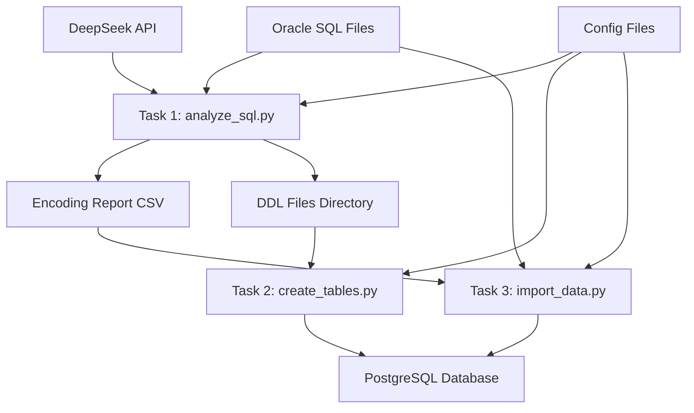

# Design Document

## Overview

Oracle到PostgreSQL迁移工具是一个由三个独立Python脚本组成的工具集，用于处理大规模Oracle SQL dump文件到PostgreSQL的迁移。工具采用模块化设计，支持大文件处理、并行执行和错误恢复。

## Architecture

### 系统架构图



### 核心组件

1. **analyze_sql.py** - SQL文件分析和DDL生成
2. **create_tables.py** - 批量建表执行
3. **import_data.py** - 数据导入执行
4. **共享模块** - 通用功能库

## Components and Interfaces

### 1. SQL文件分析器 (analyze_sql.py)

#### 主要功能
- 文件编码检测
- INSERT语句解析
- DeepSeek API集成
- DDL生成和保存

#### 核心类设计

```python
class SQLAnalyzer:
    def __init__(self, config: Config)
    def detect_encoding(self, file_path: str, sample_lines: int) -> str
    def parse_insert_statements(self, file_path: str, encoding: str) -> List[InsertStatement]
    def generate_ddl_via_api(self, table_name: str, sample_data: List[str]) -> str
    def save_ddl(self, table_name: str, ddl: str) -> None
    def generate_report(self, results: List[AnalysisResult]) -> None

class InsertStatement:
    table_name: str
    columns: List[str]
    sample_values: List[Tuple]
    
class AnalysisResult:
    file_name: str
    table_name: str
    encoding: str
    ddl_generated: bool
    error_message: Optional[str]
```

#### DeepSeek API集成

```python
class DeepSeekClient:
    def __init__(self, api_key: str, base_url: str)
    def generate_ddl(self, table_name: str, sample_inserts: List[str]) -> str
    def _build_prompt(self, table_name: str, sample_inserts: List[str]) -> str
    def _parse_response(self, response: str) -> str
```

### 2. 表创建器 (create_tables.py)

#### 主要功能
- DDL文件读取和执行
- PostgreSQL连接管理
- 依赖关系处理
- 错误处理和回滚

#### 核心类设计

```python
class TableCreator:
    def __init__(self, config: Config)
    def connect_database(self) -> None
    def read_ddl_files(self) -> List[DDLFile]
    def drop_existing_tables(self, table_names: List[str]) -> None
    def execute_ddl(self, ddl_file: DDLFile) -> ExecutionResult
    def generate_report(self, results: List[ExecutionResult]) -> None

class DDLFile:
    file_path: str
    table_name: str
    ddl_content: str
    
class ExecutionResult:
    table_name: str
    success: bool
    error_message: Optional[str]
    execution_time: float
```

### 3. 数据导入器 (import_data.py)

#### 主要功能
- SQL文件重写（数据库名称替换）
- 编码转换
- 并行数据导入
- 进度监控

#### 核心类设计

```python
class DataImporter:
    def __init__(self, config: Config)
    def load_encoding_report(self) -> Dict[str, str]
    def rewrite_sql_file(self, source_file: str, target_file: str, encoding: str) -> None
    def import_data_parallel(self, sql_files: List[str]) -> None
    def import_single_file(self, sql_file: str) -> ImportResult
    def generate_report(self, results: List[ImportResult]) -> None

class SQLRewriter:
    def __init__(self, source_db: str, target_db: str, target_schema: str)
    def rewrite_insert_statement(self, statement: str) -> str
    def convert_encoding(self, content: str, source_encoding: str, target_encoding: str) -> str

class ImportResult:
    file_name: str
    records_processed: int
    success: bool
    error_message: Optional[str]
    processing_time: float
```

### 4. 共享模块

#### 配置管理

```python
class Config:
    # 通用配置
    source_directory: str
    ddl_directory: str
    sample_lines: int
    target_encoding: str
    
    # DeepSeek API配置
    deepseek_api_key: str
    deepseek_base_url: str
    
    # PostgreSQL配置
    pg_host: str
    pg_port: int
    pg_database: str
    pg_schema: str
    pg_username: str
    pg_password: str
    
    # 并行处理配置
    max_workers: int
    batch_size: int
    
    @classmethod
    def from_file(cls, config_path: str) -> 'Config'
    @classmethod
    def from_args(cls, args: argparse.Namespace) -> 'Config'
```

#### 日志和报告

```python
class Logger:
    def __init__(self, log_level: str, log_file: str)
    def info(self, message: str) -> None
    def error(self, message: str, exception: Optional[Exception] = None) -> None
    def progress(self, current: int, total: int, message: str) -> None

class ReportGenerator:
    def generate_csv_report(self, data: List[Dict], output_path: str) -> None
    def generate_summary_report(self, results: List[Any], output_path: str) -> None
```

## Data Models

### 文件编码报告 (CSV格式)

```csv
file_name,table_name,encoding,file_size_mb,ddl_generated,error_message
table1.sql,users,utf-8,150.5,true,
table2.sql,orders,gbk,89.2,true,
table3.sql,products,utf-8,45.1,false,API call failed
```

### DDL文件命名规范

```
ddl/
├── create_users.sql
├── create_orders.sql
├── create_products.sql
└── create_order_items.sql
```

### 配置文件格式 (YAML)

```yaml
# 基本配置
source_directory: "/path/to/oracle/dumps"
ddl_directory: "./ddl"
sample_lines: 100
target_encoding: "utf-8"

# DeepSeek API配置
deepseek:
  api_key: "your-api-key"
  base_url: "https://api.deepseek.com"
  timeout: 30
  max_retries: 3

# PostgreSQL配置
postgresql:
  host: "localhost"
  port: 5432
  database: "target_db"
  schema: "public"
  username: "postgres"
  password: "password"

# 性能配置
performance:
  max_workers: 4
  batch_size: 1000
  memory_limit_mb: 1024

# 日志配置
logging:
  level: "INFO"
  file: "./migration.log"
```

## Error Handling

### 错误分类和处理策略

1. **文件访问错误**
   - 文件不存在或无权限
   - 处理：记录错误，跳过该文件，继续处理其他文件

2. **编码检测错误**
   - 无法确定文件编码
   - 处理：使用默认编码(UTF-8)，记录警告

3. **API调用错误**
   - DeepSeek API超时或失败
   - 处理：重试机制，最终失败时记录错误，跳过DDL生成

4. **数据库连接错误**
   - PostgreSQL连接失败
   - 处理：立即终止执行，提供详细错误信息

5. **SQL执行错误**
   - DDL或INSERT语句执行失败
   - 处理：记录详细错误信息，继续处理其他语句

### 错误恢复机制

```python
class ErrorHandler:
    def __init__(self, max_retries: int = 3, retry_delay: float = 1.0)
    def retry_on_failure(self, func: Callable, *args, **kwargs) -> Any
    def handle_api_error(self, error: Exception, context: str) -> None
    def handle_db_error(self, error: Exception, sql: str) -> None
```

## Testing Strategy

### 单元测试

1. **编码检测测试**
   - 测试各种编码格式的文件
   - 测试损坏的文件处理

2. **SQL解析测试**
   - 测试各种INSERT语句格式
   - 测试包含特殊字符的数据

3. **API集成测试**
   - 模拟API响应
   - 测试错误处理

### 集成测试

1. **端到端测试**
   - 使用小型测试数据集
   - 验证完整的迁移流程

2. **性能测试**
   - 测试大文件处理能力
   - 测试并行处理效果

### 测试数据准备

```python
class TestDataGenerator:
    def generate_oracle_dump(self, table_name: str, record_count: int, encoding: str) -> str
    def generate_mixed_encoding_files(self) -> List[str]
    def create_test_database(self) -> None
```

## Performance Considerations

### 内存管理
- 流式处理大文件，避免一次性加载到内存
- 分批处理INSERT语句
- 及时释放不需要的对象

### 并行处理
- 文件级别的并行处理
- 数据库连接池管理
- 线程安全的日志记录

### 优化策略
- 使用COPY命令替代INSERT语句（如果可能）
- 批量提交事务
- 索引延迟创建

```python
class PerformanceOptimizer:
    def optimize_insert_statements(self, statements: List[str]) -> str
    def convert_to_copy_format(self, insert_statements: List[str]) -> str
    def batch_execute(self, statements: List[str], batch_size: int) -> None
```