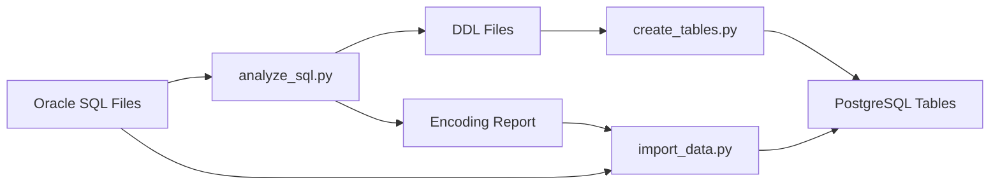

# Oracle to PostgreSQL Migration Tool

A comprehensive Python tool for migrating Oracle SQL dump files to PostgreSQL database. The tool consists of three independent scripts that handle different aspects of the migration process.

## 📚 Documentation

- **[Usage Guide](docs/USAGE.md)** - Detailed instructions for using each script
- **[Examples & Use Cases](docs/EXAMPLES.md)** - Practical examples for different scenarios
- **[Troubleshooting Guide](docs/TROUBLESHOOTING.md)** - Solutions for common issues
- **[Configuration Template](config.yaml.template)** - Complete configuration reference

## ✨ Features

- **Automatic encoding detection** for SQL dump files (UTF-8, GBK, Latin1, etc.)
- **AI-powered DDL generation** using DeepSeek API for accurate schema conversion
- **Parallel data import** for large files (handles files up to tens of GB)
- **Configurable parameters** via YAML config files and command line arguments
- **Comprehensive reporting** with CSV reports and detailed logs
- **Error handling and recovery** mechanisms with retry logic
- **Memory-efficient processing** with streaming and batch processing
- **Production-ready** with extensive testing and validation

## 🏗️ Architecture

The tool consists of three main scripts that work together:

1. **analyze_sql.py** - Analyzes SQL files, detects encoding, and generates PostgreSQL DDL
2. **create_tables.py** - Creates tables in PostgreSQL using generated DDL files
3. **import_data.py** - Imports data with encoding conversion and parallel processing



## 🚀 Quick Start

### 1. Installation

```bash
# Clone the repository
git clone <repository-url>
cd oracle-to-postgres-migration

# Install dependencies
pip install -r requirements.txt

# Create configuration file
cp config.yaml.template config.yaml
```

### 2. Configuration

Edit `config.yaml` with your settings:

```yaml
# Minimum required configuration
source_directory: "/path/to/your/oracle/dumps"
deepseek:
  api_key: "your-deepseek-api-key"
postgresql:
  database: "your_target_database"
  username: "your_username"
  password: "your_password"
```

### 3. Run Migration

```bash
# Step 1: Analyze Oracle SQL files
python analyze_sql.py --config config.yaml

# Step 2: Create PostgreSQL tables
python create_tables.py --config config.yaml

# Step 3: Import data
python import_data.py --config config.yaml
```

For detailed instructions, see the [Usage Guide](docs/USAGE.md).

## Configuration

### Required Settings

- `source_directory`: Path to Oracle SQL dump files
- `deepseek.api_key`: Your DeepSeek API key
- `postgresql.database`: Target PostgreSQL database
- `postgresql.username`: PostgreSQL username
- `postgresql.password`: PostgreSQL password

### Optional Settings

See `config.yaml.template` for all available options.

## Usage

### Step 1: Analyze SQL Files

```bash
python analyze_sql.py --source-directory /path/to/dumps --config config.yaml
```

This will:
- Detect file encodings
- Generate PostgreSQL DDL files in `./ddl/` directory
- Create encoding report CSV

### Step 2: Create Tables

```bash
python create_tables.py --pg-database mydb --config config.yaml
```

Options:
- `--drop-existing`: Drop existing tables before creating new ones
- `--pg-schema`: Specify target schema (default: public)

### Step 3: Import Data

```bash
python import_data.py --source-directory /path/to/dumps --config config.yaml
```

This will:
- Read encoding information from Step 1
- Convert file encodings to UTF-8
- Rewrite SQL statements for PostgreSQL
- Import data in parallel

## Command Line Options

All scripts support:
- `--config`: Configuration file path
- `--log-level`: Logging level (DEBUG, INFO, WARNING, ERROR)
- `--log-file`: Log file path

See individual script help for specific options:
```bash
python analyze_sql.py --help
python create_tables.py --help
python import_data.py --help
```

## Output Files

- `./ddl/create_*.sql`: Generated DDL files
- `./reports/encoding_analysis_*.csv`: File encoding analysis
- `./reports/execution_results_*.csv`: Table creation results
- `./reports/import_results_*.csv`: Data import results
- `./migration.log`: Detailed execution log

## Error Handling

The tool includes comprehensive error handling:
- Failed API calls are retried with exponential backoff
- File processing errors are logged and skipped
- Database errors are recorded with detailed information
- Progress can be resumed from interruption points

## Performance Considerations

- Large files are processed in streaming mode to minimize memory usage
- Parallel processing is configurable via `max_workers` setting
- Batch processing prevents memory overflow
- Connection pooling optimizes database operations

## 🔧 Troubleshooting

For detailed troubleshooting information, see the [Troubleshooting Guide](docs/TROUBLESHOOTING.md).

### Quick Fixes

| Issue | Solution |
|-------|----------|
| API Key Error | Verify DeepSeek API key in config.yaml |
| Database Connection | Check PostgreSQL credentials and connectivity |
| File Encoding Issues | Use `--log-level DEBUG` to see encoding detection |
| Memory Issues | Reduce `batch_size` and `max_workers` in config |
| Permission Errors | Check file/directory permissions |

### Debug Mode

Enable debug logging for detailed information:
```bash
python analyze_sql.py --log-level DEBUG --config config.yaml
```

## License

This project is provided as-is for database migration purposes.